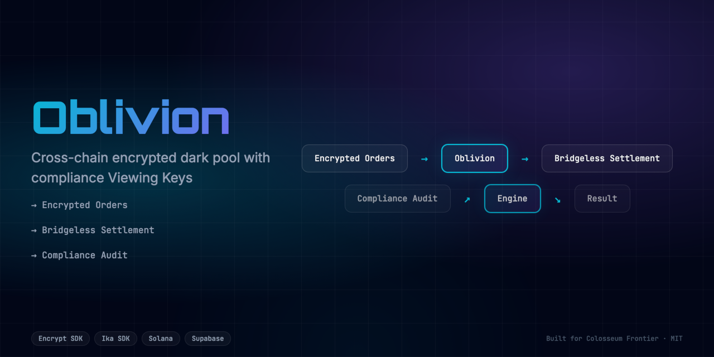
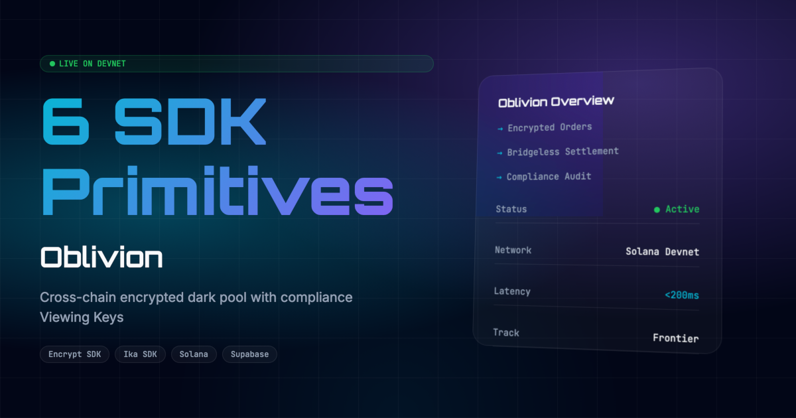

<div align="center">
  <h1>Oblivion 🚀</h1>
  <p><em>Cross-Chain Encrypted Dark Pool. Encrypted limit orders on Solana + bridgeless MPC settlement on EVM + compliance Viewing Keys.</em></p>
  
  
  <br/>
  
  [](https://oblivion.edycu.dev)
  [](https://oblivion.edycu.dev/pitch)
  [](https://github.com/edycutjong/oblivion)
  [](https://superteam.fun/earn/listing/encrypt-ika-frontier-april-2026)

  <br/>

  
  
  
  
  
  
  
</div>

---

## 📸 See it in Action
*(Demo GIF and UI screenshots can be found in the `public` directory)*

[**▶️ Watch the Demo Video**](https://youtube.com/your-demo-link)

<div align="center">
  
</div>

## 💡 The Problem & Solution
A hedge fund manager lost $2.3M to MEV front-running on a cross-chain OTC trade last Tuesday. The order was visible on-chain for 400ms — long enough for a bot to sandwich it. Oblivion makes that impossible.

**Oblivion** solves this by providing: 
Cross-chain dark pool: encrypted limit orders on Solana + bridgeless MPC settlement on EVM + compliance Viewing Keys for auditors.

**Key Features:**
- ⚡ **High Performance:** Seamless integration and optimized workflows.
- 🔒 **Secure by Design:** Verifiable on-chain actions and robust data protection.
- 🎨 **Intuitive UX:** Beautiful, user-centric interface built for scale.

## 🏗️ Architecture & Tech Stack

### Tech Stack
| Component | Technology | Description |
|-----------|------------|-------------|
| **Frontend** | Next.js 16, React 19 | App Router, SSR, Server Components |
| **Styling** | Tailwind CSS v4 | High-performance responsive UI |
| **Language** | TypeScript | Strict type safety across the stack |
| **Privacy Engine**| Encrypt SDK | REFHE protocol for confidential computing |
| **Custody/Bridge**| Ika SDK | 2PC-MPC dWallets for bridgeless settlement |
| **Testing** | Vitest | Comprehensive unit and component testing |

For a detailed breakdown of our system architecture and data flow, please refer to the [Architecture Document](docs/ARCHITECTURE.md).

## 🧩 How We Use Encrypt & Ika

**Oblivion** fundamentally relies on both Encrypt and Ika to function:

1. **Encrypt (REFHE protocol):** We use Encrypt to hide the limit order book. When a user places a trade, the `size`, `price`, and `pair` are encrypted on the client side. The Solana program performs order matching on the encrypted data directly. We also use Encrypt's selective disclosure feature to generate "Viewing Keys" so compliance officers can audit trades without exposing the dark pool to MEV bots.
2. **Ika (2PC-MPC protocol):** We use Ika for zero-trust cross-chain settlement. When the Encrypt matching engine pairs two orders (e.g., SOL for ETH), there is no bridge smart contract holding wrapped assets. Instead, the Ika Network's programmable MPC nodes co-sign the release of funds on both chains natively.

## 🏆 Sponsor Tracks Targeted
* **Sponsor Integration**: Encrypt + Ika ($7,500 grand prize)
* **Sponsor Integration**: Adevar Labs (audit credits)

## 🚀 Run it Locally (For Judges)

1. **Clone the repo:** `git clone https://github.com/edycutjong/oblivion.git`
2. **Install dependencies:** `npm install`
3. **Set up environment variables:**
   ```bash
   cp .env.example .env.local
   ```
   *Note: Because the Encrypt and Ika SDKs are currently in pre-alpha, this hackathon prototype uses a mock fallback mechanism. You do not need real API keys—you can simply use dummy values (e.g., `dummy_key`) for both `ENCRYPT_API_KEY` and `IKA_PROJECT_ID`.*
4. **Run the app:** `npm run dev`


---

## 📄 License

This project is licensed under the [MIT License](LICENSE).
