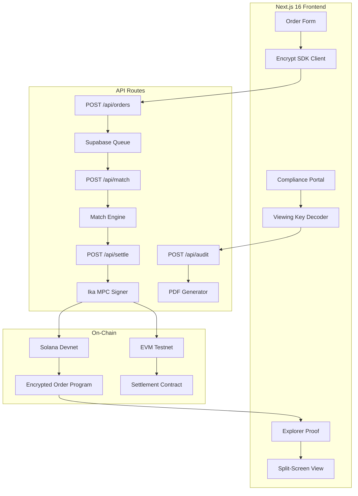

# Oblivion — Technical Architecture

## Tech Stack

| Layer | Technology | Why |
|---|---|---|
| **Frontend** | Next.js 16 (App Router), React 19 | Hackathon standard, fast iteration |
| **Styling** | Tailwind CSS v4 | Dark terminal aesthetic |
| **Blockchain (Solana)** | Anchor, @solana/web3.js, Encrypt SDK | Encrypted orderbooks, private limit orders, viewing keys |
| **Blockchain (Cross-Chain)** | Ika SDK | MPC signatures, bridgeless asset movement |
| **Database** | Supabase (PostgreSQL) | P2P order queue, user sessions, audit logs |
| **PDF Generation** | jsPDF | Compliance audit reports |
| **Auth** | Solana wallet adapter (Phantom/Solflare) | Wallet-based auth |

## System Architecture



## Database Schema

```sql
-- Supabase tables
CREATE TABLE orders (
    id UUID PRIMARY KEY DEFAULT gen_random_uuid(),
    wallet_address TEXT NOT NULL,
    encrypted_order_id TEXT NOT NULL,  -- Encrypt SDK order ID
    side TEXT CHECK (side IN ('buy', 'sell')),
    base_token TEXT NOT NULL,          -- e.g., 'SOL'
    quote_token TEXT NOT NULL,         -- e.g., 'ETH'
    status TEXT DEFAULT 'pending' CHECK (status IN ('pending', 'matched', 'settling', 'settled', 'failed')),
    counterparty_wallet TEXT,
    ika_settlement_tx TEXT,            -- Ika MPC tx hash
    solana_tx TEXT,                    -- Solana encrypted tx hash
    evm_tx TEXT,                       -- EVM settlement tx hash
    created_at TIMESTAMPTZ DEFAULT NOW(),
    settled_at TIMESTAMPTZ
);

CREATE TABLE audit_logs (
    id UUID PRIMARY KEY DEFAULT gen_random_uuid(),
    auditor_wallet TEXT NOT NULL,
    viewing_key_hash TEXT NOT NULL,
    orders_accessed UUID[],
    report_generated BOOLEAN DEFAULT FALSE,
    created_at TIMESTAMPTZ DEFAULT NOW()
);

-- RLS: anon can read own orders, service_role for writes
ALTER TABLE orders ENABLE ROW LEVEL SECURITY;
CREATE POLICY "Users read own orders" ON orders FOR SELECT USING (wallet_address = current_setting('request.jwt.claims')::json->>'sub');
```

## API Endpoints

| Method | Path | Description |
|---|---|---|
| POST | `/api/orders` | Place encrypted limit order |
| GET | `/api/orders` | List user's orders |
| POST | `/api/match` | Match pending orders (hardcoded P2P) |
| POST | `/api/settle` | Execute cross-chain MPC settlement |
| POST | `/api/audit` | Generate compliance report from Viewing Key |
| GET | `/api/explorer-proof/:txId` | Fetch encrypted vs. decrypted comparison |

## SDK Integration Map

| SDK | Feature | File | Usage |
|---|---|---|---|
| **Encrypt** | Encrypted orderbooks | `src/lib/encrypt-client.ts` | Create encrypted order on-chain |
| **Encrypt** | Private limit orders | `src/lib/encrypt-client.ts` | Hide price + size in order |
| **Encrypt** | Viewing keys | `src/lib/viewing-key.ts` | Selective disclosure for auditors |
| **Ika** | MPC signatures | `src/lib/ika-client.ts` | Multi-party computation for settlement |
| **Ika** | Bridgeless movement | `src/lib/ika-client.ts` | No bridge contracts needed |
| **Ika** | Cross-chain messaging | `src/lib/ika-client.ts` | Coordinate settlement across chains |

## Key Libraries

```json
{
    "@solana/web3.js": "^2.0",
    "@coral-xyz/anchor": "^0.30",
    "@encrypt-sdk/core": "latest",
    "@ika-sdk/core": "latest",
    "@supabase/supabase-js": "^2.0",
    "jspdf": "^2.5",
    "recharts": "^2.0"
}
```
